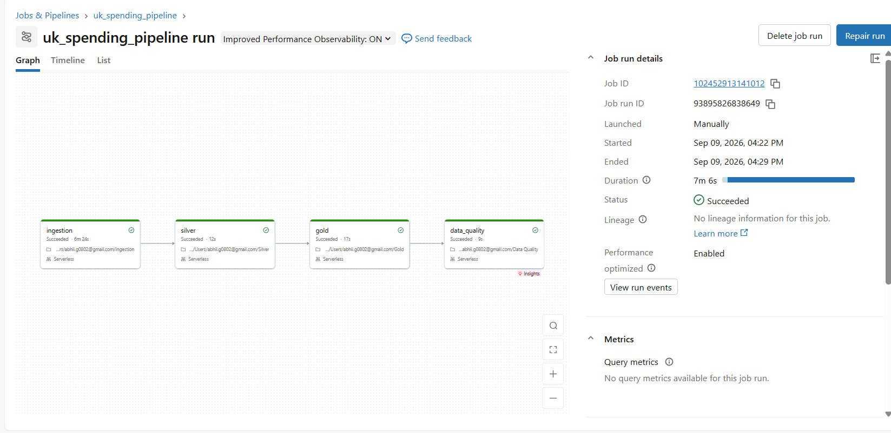
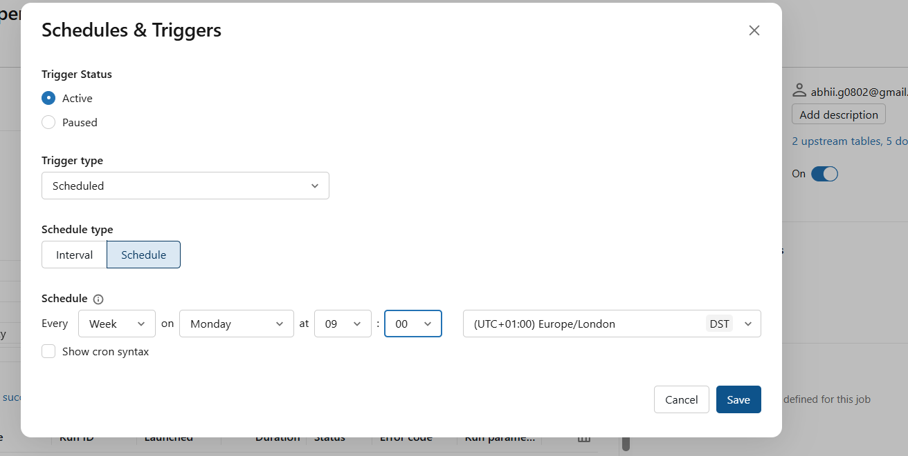

An end-to-end data engineering pipeline that ingests live UK consumer card-spending data from the ONS API, processes it through a Medallion Architecture (Bronze → Silver → Gold), and produces analytics-ready tables - orchestrated as a scheduled, automated workflow on Databricks with Delta Lake.

---

## Project Overview

This project demonstrates a production-style batch data pipeline built around real, live data from the UK Office for National Statistics (ONS). It tracks how UK consumers spend across four categories - Social, Staple, Delayable, and Work-Related, using debit and credit card transaction indices.

The pipeline is fully automated: it fetches the latest data version from the ONS API dynamically, transforms it through layered Medallion stages, validates data quality, and runs on a weekly schedule.

---

## Architecture

ONS API (uk-spending-on-cards)
│
▼
Ingestion (Python + requests)
│
▼
Bronze - raw data, schema-cleaned, stored as Delta
│
▼
Silver - cleaned, typed, nulls handled, proper date column built
│
▼
Gold - 3 business-ready aggregated tables
│
▼
Data Quality - automated validation checks

*The pipeline running end-to-end as a Databricks Workflow with task dependencies.*

---

## Tech Stack

| Layer | Technology |
|-------|-----------|
| Data Source | ONS Beta REST API |
| Language | Python, PySpark |
| Processing | Databricks (Serverless) |
| Table Format | Delta Lake |
| Orchestration | Databricks Workflows |
| Scheduling | Weekly automated trigger |
| Version Control | Git / GitHub |

---

## Pipeline Stages

### 1. Ingestion
- Queries the ONS API to find the **latest data version dynamically**
- Downloads the CSV with a proper request header to handle server restrictions
- Cleans column names to meet Delta Lake naming rules
- Lands raw data into the **Bronze** Delta table

### 2. Silver Layer
- Removes rows with missing spending values
- Drops the "Aggregate" total to prevent double-counting
- Constructs a proper `date` column from separate year and day-month fields
- Rounds and renames columns to clear business names

### 3. Gold Layer
Three purpose-built aggregated tables, each answering a distinct question:

| Table | Grain | Answers |
|-------|-------|---------|
| `gold_spend_by_year` | Year × Category | How did spending change year over year? |
| `gold_spend_seasonal` | Calendar day × Category | What is the typical within-year pattern? |
| `gold_spend_daily` | Full date × Category | Day-by-day spending timeline |

### 4. Data Quality
Automated validation of the Silver table:
- Row count check
- Null checks on key columns
- Duplicate detection
- Category integrity check
- Fails the workflow if critical checks don't pass

---

## Orchestration & Scheduling

The four stages run as dependent tasks in a Databricks Workflow. Each task only executes after its predecessor succeeds. The pipeline is scheduled to run **weekly (Mondays, 09:00 Europe/London)**, matching the data's update frequency.

---

## Key Engineering Decisions

- **Dynamic version fetching** - the pipeline always pulls the latest ONS data version, keeping the "live data" claim honest
- **Layered Medallion design** - Silver holds the complete cleaned dataset; Gold tables are lean and derive only what each analysis needs
- **Single source of truth for time** - a proper `date` column in Silver, with year/day-month derived downstream rather than stored redundantly
- **Fail-fast data quality** - assertions stop the pipeline if data integrity checks fail

---

## Data Note

Data is UK-level only (no regional breakdown available in this dataset). The most recent year in the source may be partial, reflecting the ONS release cycle.

---

## Author

**Abhiram Gadikota**
